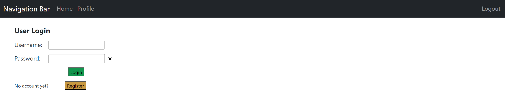
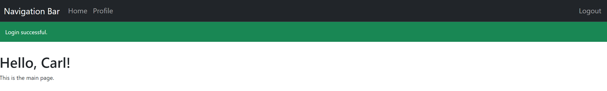

# Simple Flask User Logging System

This python project aims the development of a simple web application using python Flask framework. To keep firstly things simple, the creation of a User Logging System is realised. 

Upon running the application, the a very simple builtin server is launched and can be used as a development server. The pages "/home", "/profile" are placeholder pages for future implementations, whereas the pages "/login", "/logout" and "/register" contain the main functionalities build in here. The classical registration, login and logout functions are present here as well and the system posseses the permanent sessions property (which keeps you logged in for a time duraction of 5 minutes). To improve the user experience and ease of understanding, message flashing was introduced. 

Regarding the topic of user registering and logging, I used some simple rules of username and password creation and encrypted each password using the bcrypt library and the script saves all credentials locally in a config.ini (alternative to a database creation). In this manner the passwords can be saved and later used for login authentication and aren't saved as plain text, which could be a potential security issue.

## Libraries used

- flask
- bcrypt

## Screenshots

*User Login*

*User successfully logged in*